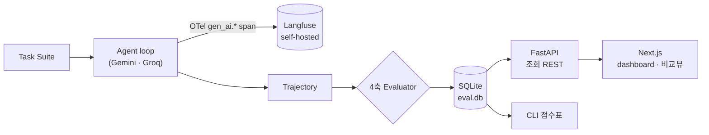

# agent-eval-lab

[English](README.md) | **한국어**


Framework-agnostic **AI Agent 평가 · 관측 인프라**.
어떤 LLM(Gemini / Groq / …)이든 어댑터로 받아 **동일한 4축**으로 평가하고,
OpenTelemetry GenAI 표준으로 trace 를 남겨 **결과 + 과정**을 한 번에 본다.



## 왜 만드나

LLM Agent 는 같은 프롬프트에도 **매번 다르게 행동**한다 — 어떤 tool 을 부를지, 몇 번 만에 풀지, 비용이 얼마일지가 실행마다 달라진다.
그래서 "이 Agent 가 좋아졌나 / 나빠졌나"를 **느낌이 아니라 숫자로** 말하기 어렵다.
이 프로젝트는 Agent 의 행동을 정량 측정 가능한 대상으로 만든다.

## 이걸로 확인할 수 있는 것

- **모델 간 비교** — 같은 task suite·같은 4축으로 Gemini vs Groq 를 정량 비교. 대시보드 `/compare` 에서 축별 trade-off 가시화.
- **회귀 감지** — 프롬프트/모델을 바꿨을 때 성공률·비용·step 효율이 좋아졌는지 나빠졌는지 run 간 비교 (`RunConfig` snapshot 으로 조건 통제).
- **실패 원인 추적** — 점수가 낮을 때 OTel trace 트리(LLM step + tool step)로 "어느 호출에서 틀렸는지"까지 드릴다운.
- **비용·지연 가시화** — Agent 한 번 돌릴 때 token / latency / $ 가 얼마인지, 어느 task 가 가장 비싼지.

## 평가 4축

| 축 | 측정 | 방법 |
|---|---|---|
| **Task 성공률** (`task_success`) | 작업을 제대로 완수했나 | 결정적 assert + LLM-as-judge 2단계 |
| **Tool-call 정확도** (`tool_call`) | 도구를 올바르게 호출했나 | 기대 tool multiset 대비 F1 + irrelevance |
| **Trajectory 효율** (`trajectory_efficiency`) | 군더더기 없이 풀었나 | 최적 step 수 대비 실제 step (과-step 페널티) |
| **비용·지연** (`cost`) | 예산 안에서 했나 | `min(예산/실제$, timeout/순수 latency)` 게이트 |

> 실측 예 — `suite_v1`(10 task): **tool_call 은 Groq 100% > Gemini 90%**(Gemini 가 일부 케이스 tool 거부), **task_success 는 Gemini 90% > Groq 70%**. 단일 평균(0.95 vs 0.93)만으론 안 보이던 축별 강약이 드러난다.

## 빠른 시작

```bash
# 1) 설치
uv sync
cp .env.example .env        # GEMINI_API_KEY / GROQ_API_KEY 채우기 (둘 다 무료 tier)

# 2) 평가 실행 — 4축 자동 채점 → SQLite 저장 + 점수표 출력
uv run agent-eval-lab run --suite suite_v1 --agent gemini
uv run agent-eval-lab run --suite suite_v1 --agent groq

# 3) 조회 API + 대시보드
uv run agent-eval-lab serve                       # http://localhost:8000/docs (Swagger)
cd dashboard && npm install && npm run dev        # http://localhost:3001
#  └ macOS: 루트의 start-dashboard.command 더블클릭 → 둘 다 기동 + 브라우저 오픈

# 4) 관측 (선택) — OTel trace 를 Langfuse 로
docker compose up -d                              # http://localhost:3000
#  .env 에 LANGFUSE_HOST/PUBLIC_KEY/SECRET_KEY 있으면 자동 전송
```

명령: `run`(평가) · `report <run_id>`(점수표) · `list-runs`(목록) · `serve`(API) · `run-once`(단일 prompt 디버깅).

## 멀티 프로바이더

| LLM | 어댑터 | 상태 | 비고 |
|---|---|---|---|
| Gemini | `agents/gemini_agent.py` | ✅ | `google-genai`, 무료 tier |
| Groq (Llama 3.3 70B) | `agents/groq_agent.py` | ✅ | OpenAI 호환, 무료 tier |
| OpenAI / Claude | — | 어댑터 추가만 | 같은 `Agent` Protocol 구현 |

새 LLM = `Agent` Protocol(`async run(task, tools) -> Trajectory` + OTel span emit)을 만족하는 어댑터 한 장. 평가 파이프라인은 무변경.

## 설계 원칙

- **Framework-agnostic** — `Agent` / `Tool` / `Evaluator` 를 Protocol(구조적 타이핑)로 정의. 새 LLM 은 어댑터만.
- **데이터 모델 우선** — `Task → Trajectory → EvalScore → RunResult` 를 먼저 고정, 평가/저장/조회/API/UI 가 전부 이를 통해 흐름.
- **재현성** — `RunConfig`(model / temperature / prompt hash / git sha)를 frozen snapshot 으로 박제.
- **표준 관측** — 모든 LLM / tool 호출은 OTel `gen_ai.*` span. Langfuse 는 받는 쪽(OTLP)일 뿐, 벤더 종속 0.
- **Agent loop 자체 구현** — high-level SDK 없이 LLM 호출 → function call 파싱 → tool dispatch 루프를 직접 작성.
- **관심사 분리** — 쓰기(CLI 평가)와 읽기(FastAPI 조회)를 분리, API 는 DB 를 오염시키지 않는다.

## 기술 스택

**백엔드** Python 3.13 · uv · `google-genai` · `groq` · OpenTelemetry SDK(OTLP) · FastAPI · Typer · SQLite · tenacity
**관측** Langfuse v3 (docker-compose 셀프호스트) · OTel GenAI semconv
**프론트** Next.js 16 (App Router) · TypeScript · Tailwind CSS
**테스트** pytest · pytest-asyncio

## 구조

```
agent-eval-lab/
├── src/agent_eval_lab/
│   ├── core/         # 데이터 모델(types) + Protocol
│   ├── agents/       # LLM 어댑터 (gemini / groq)
│   ├── tools/        # tool 정의(calc/weather/file) + registry
│   ├── evaluators/   # 평가 4축 (task_success/tool_call/trajectory/cost)
│   ├── tracing/      # OTel 셋업 (콘솔 + OTLP→Langfuse)
│   ├── runner/       # 오케스트레이션 (async run_all)
│   ├── storage/      # 결과 저장/조회 (SQLite)
│   ├── api/          # FastAPI 조회 REST (/runs, /compare)
│   └── cli/          # 진입점 (run / report / list-runs / serve / run-once)
├── dashboard/        # Next.js 대시보드 (목록 / 상세 / 모델 비교)
├── docker-compose.yml # Langfuse v3 셀프호스트
└── start-dashboard.command # macOS 런처
```

## 라이선스

MIT
