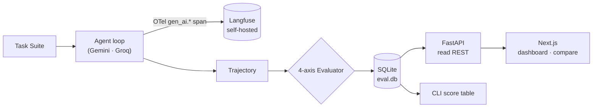
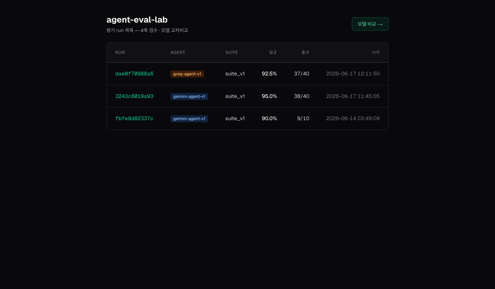
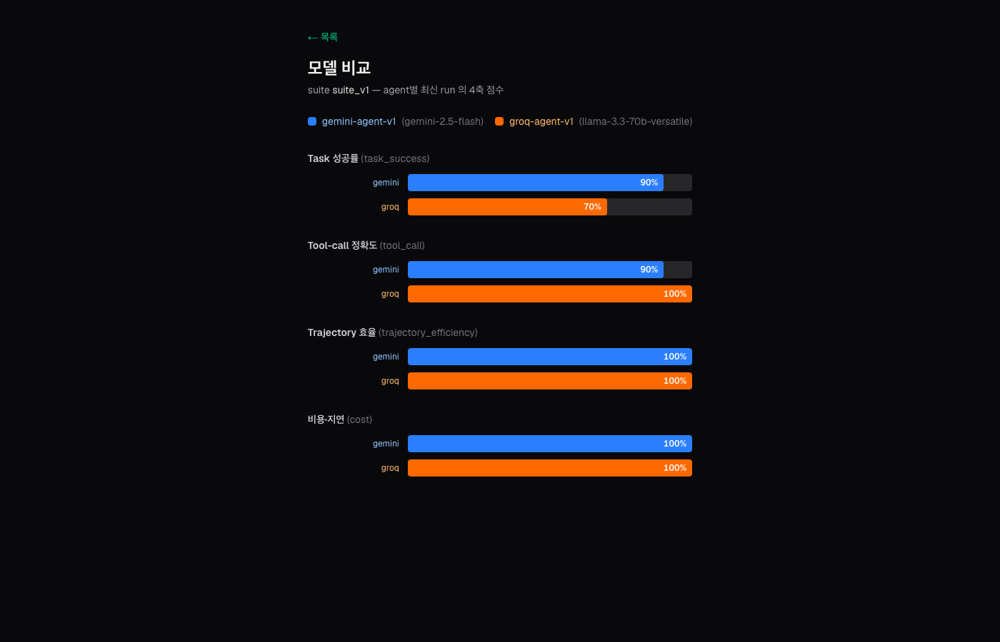

# agent-eval-lab

**English** | [한국어](README.ko.md)


Framework-agnostic **evaluation & observability infrastructure for AI agents**.
Plug in any LLM (Gemini / Groq / …) through an adapter, score it on the **same 4 axes**,
and emit OpenTelemetry GenAI-standard traces so you see both the **result and the process**.



## Screenshots

**Run list** — evaluation runs with 4-axis averages (Gemini vs Groq)



**Model comparison** (`/compare`) — per-axis bars reveal the trade-off: `tool_call` Groq 100% > Gemini 90%, while `task_success` is the opposite



## Why

LLM agents **behave differently on every run** of the same prompt — which tools they call, how many
steps they take, how much it costs all vary run to run. That makes it hard to say "did this agent
get *better* or *worse*?" with anything but a gut feeling.
This project turns agent behavior into something you can **measure with numbers**.

## What you can do with it

- **Compare models** — score Gemini vs Groq on the same task suite and the same 4 axes. The dashboard `/compare` view surfaces per-axis trade-offs.
- **Catch regressions** — when you change a prompt/model, compare success rate, cost, and step efficiency across runs (`RunConfig` snapshot controls for conditions).
- **Trace failures** — when a score is low, drill into the OTel trace tree (LLM steps + tool steps) to see *which call* went wrong.
- **See cost & latency** — tokens / latency / $ per agent run, and which task is the most expensive.

## The 4 axes

| Axis | Measures | How |
|---|---|---|
| **Task success** (`task_success`) | Did it complete the task? | Deterministic asserts + LLM-as-judge (2-stage) |
| **Tool-call accuracy** (`tool_call`) | Did it call the right tools? | F1 over expected tool multiset + irrelevance penalty |
| **Trajectory efficiency** (`trajectory_efficiency`) | Did it solve it without waste? | Optimal vs actual step count (over-step penalty) |
| **Cost & latency** (`cost`) | Within budget? | `min(budget/actual$, timeout/pure-latency)` gate |

> Real example — `suite_v1` (10 tasks): **tool_call is Groq 100% > Gemini 90%** (Gemini refuses tools on some cases), while **task_success is Gemini 90% > Groq 70%**. The single average (0.95 vs 0.93) hides this per-axis trade-off; the 4-axis breakdown reveals it.

## Quick start

```bash
# 1) Install
uv sync
cp .env.example .env        # fill GEMINI_API_KEY / GROQ_API_KEY (both free tier)

# 2) Run evaluation — auto-scores 4 axes, saves to SQLite, prints a table
uv run agent-eval-lab run --suite suite_v1 --agent gemini
uv run agent-eval-lab run --suite suite_v1 --agent groq

# 3) Read API + dashboard
uv run agent-eval-lab serve                       # http://localhost:8000/docs (Swagger)
cd dashboard && npm install && npm run dev        # http://localhost:3001
#  └ macOS: double-click start-dashboard.command → starts both + opens browser

# 4) Observability (optional) — ship OTel traces to Langfuse
docker compose up -d                              # http://localhost:3000
#  auto-exports when LANGFUSE_HOST/PUBLIC_KEY/SECRET_KEY are set in .env
```

Commands: `run` (evaluate) · `report <run_id>` (score table) · `list-runs` · `serve` (API) · `run-once` (single-prompt debug).

## Multi-provider

| LLM | Adapter | Status | Notes |
|---|---|---|---|
| Gemini | `agents/gemini_agent.py` | ✅ | `google-genai`, free tier |
| Groq (Llama 3.3 70B) | `agents/groq_agent.py` | ✅ | OpenAI-compatible, free tier |
| OpenAI / Claude | — | adapter only | implement the same `Agent` Protocol |

A new LLM = one adapter that satisfies the `Agent` Protocol (`async run(task, tools) -> Trajectory` + emits OTel spans). The evaluation pipeline stays unchanged.

## Design principles

- **Framework-agnostic** — `Agent` / `Tool` / `Evaluator` defined as Protocols (structural typing). A new LLM is just an adapter.
- **Data model first** — `Task → Trajectory → EvalScore → RunResult` is fixed first; evaluation/storage/API/UI all flow through it.
- **Reproducible** — `RunConfig` (model / temperature / prompt hash / git sha) is frozen as a snapshot.
- **Standard observability** — every LLM/tool call is an OTel `gen_ai.*` span. Langfuse is just a receiver (OTLP); zero vendor lock-in.
- **Hand-written agent loop** — no high-level SDK; the LLM-call → function-call-parse → tool-dispatch loop is implemented directly.
- **Separation of concerns** — writes (CLI evaluation) and reads (FastAPI) are split; the API never mutates the DB.

## Tech stack

**Backend** Python 3.13 · uv · `google-genai` · `groq` · OpenTelemetry SDK (OTLP) · FastAPI · Typer · SQLite · tenacity
**Observability** Langfuse v3 (self-hosted via docker-compose) · OTel GenAI semconv
**Frontend** Next.js 16 (App Router) · TypeScript · Tailwind CSS
**Testing** pytest · pytest-asyncio

## Structure

```
agent-eval-lab/
├── src/agent_eval_lab/
│   ├── core/         # data models (types) + Protocols
│   ├── agents/       # LLM adapters (gemini / groq)
│   ├── tools/        # tool definitions (calc/weather/file) + registry
│   ├── evaluators/   # the 4 axes (task_success/tool_call/trajectory/cost)
│   ├── tracing/      # OTel setup (console + OTLP→Langfuse)
│   ├── runner/       # orchestration (async run_all)
│   ├── storage/      # result persistence/query (SQLite)
│   ├── api/          # FastAPI read REST (/runs, /compare)
│   └── cli/          # entry points (run / report / list-runs / serve / run-once)
├── dashboard/        # Next.js dashboard (list / detail / model compare)
├── docker-compose.yml # Langfuse v3 self-hosted
└── start-dashboard.command # macOS launcher
```

## License

MIT
