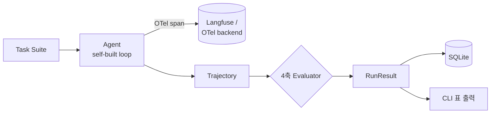

# agent-eval-lab


Framework-agnostic **AI Agent 평가 · 관측 인프라**.
어떤 LLM(Gemini / Claude / OpenAI)이든 어댑터로 받아서 동일한 4축으로 평가하고,
OpenTelemetry GenAI 표준으로 trace 를 남긴다.



## 왜 만드나

LLM Agent 는 같은 프롬프트에도 **매번 다르게 행동**한다 — 어떤 tool 을 부를지, 몇 번 만에 풀지, 비용이 얼마일지가 실행마다 달라진다.
그래서 "이 Agent 가 좋아졌나 / 나빠졌나"를 **느낌이 아니라 숫자로** 말하기 어렵다.
이 프로젝트는 Agent 의 행동을 정량 측정 가능한 대상으로 만든다.

## 이걸로 확인할 수 있는 것

- **회귀 감지** — 프롬프트/모델을 바꿨을 때 성공률·비용·step 효율이 좋아졌는지 나빠졌는지를 run 간 비교로 확인 (`RunConfig` snapshot 으로 조건 통제).
- **모델 간 비교** — 같은 task suite·같은 4축으로 Gemini vs Claude vs GPT 를 정량 비교.
- **실패 원인 추적** — 점수가 낮을 때 OTel trace 트리(LLM step + tool step)로 "어느 호출에서 틀렸는지"까지 드릴다운.
- **비용·지연 가시화** — Agent 한 번 돌릴 때 token / latency / $ 가 얼마인지, 어느 task 가 가장 비싼지.

## 뭐가 좋은가

- **벤더 종속 0** — Protocol 기반이라 새 LLM 은 어댑터 한 장(≈50줄)만 추가하면 같은 평가에 들어온다.
- **표준 관측** — OpenTelemetry GenAI semconv 를 따르므로 Langfuse 등 어떤 OTel 백엔드에도 그대로 연결.
- **재현 가능** — model / temperature / prompt hash / git sha 를 박제해 "그때 그 점수"를 다시 만들 수 있다.

## 평가 4축

| 축 | 내용 |
|---|---|
| Task 성공률 | 결정적 assert + LLM-as-judge 2단계 |
| Tool-call 정확도 | 기대 tool vs 실제 호출 비교 |
| Trajectory 효율 | 최적 step 수 대비 실제 step 수 |
| Latency · 비용 | token / 지연 / $ 집계 |

## 설계 원칙

- **Framework-agnostic** — `Agent` / `Tool` / `Evaluator` 를 Protocol 로 정의. 새 LLM 은 어댑터만 추가.
- **데이터 모델 우선** — `Task → Trajectory → EvalScore → RunResult` 를 먼저 고정, 평가/저장/조회가 전부 이를 통해 흐름.
- **재현성** — `RunConfig`(model / temperature / prompt hash / git sha) 를 frozen snapshot 으로 박제.
- **표준 관측** — 모든 LLM / tool 호출은 OTel span. Langfuse 는 받는 쪽일 뿐.
- **Agent loop 자체 구현** — high-level SDK 없이 LLM 호출 → function call 파싱 → tool dispatch 루프를 직접 작성.

## 기술 스택

Python 3.12+ · uv · `google-genai`(Gemini) · OpenTelemetry SDK · Langfuse · SQLite · Typer · pytest

## 구조

```
src/agent_eval_lab/
├── core/         # 데이터 모델 + Protocol
├── agents/       # LLM 어댑터 (Gemini / Claude / OpenAI)
├── tools/        # tool 정의 + registry
├── evaluators/   # 평가 4축
├── tracing/      # OTel 셋업
├── runner/       # 오케스트레이션
├── storage/      # 결과 저장/조회 (SQLite)
└── cli/          # 진입점 (run / report / list)
```

## 진행 상태

🚧 개발 중 — core 데이터 모델 완료, agent loop / evaluator 구현 진행.
